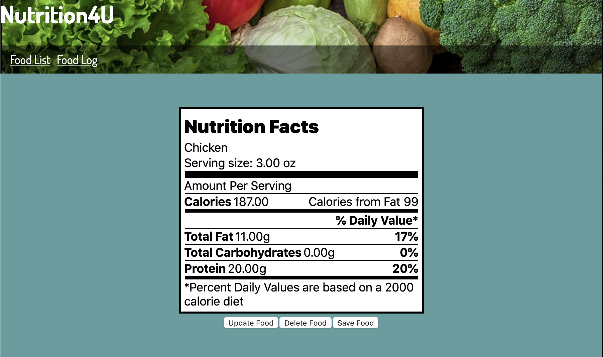

# Nutrition4U

## Description

You are what you eat! And if that’s the case, you better know exactly what’s in whatever your eating. Nutrition4U is a full-stack application built utilizing the Django REST framework API backend and React Functional Components in the front end. Users have the ability to search an extensive catalog of foods, see their nutritional content, and add it to a daily food log. Utilizing Nutrition4U makes tracking your daily macronutrient content a breeze so that the pounds will be melting off in no time.    

## List of Features

The application database contains a food model that consists of the food name, serving size, calories, fat content, carbohydrate content, and protein content. The model is built with create, read, update and destroy functionality allowing end-users to easily manipulate backend data using front end forms and buttons that utilize Axios to make, GET, POST, PUT and DELETE requests. The React UI is built utilizing React Router allowing users to rapidly toggle between multiple views. 

If a user navigates to the food list link they will see a list of every food currently in our database which they can easily dynamically search through, or create a new entry utilizing the create food form. When navigating to an individual food from the front end a nutrition label is rendered with daily value percentages calculated based on a 2,000 calorie diet. Users can delete, update or save the food to a log from the individual view. Upon saving, a copy of the food will be added to the food log table which can be accessed utilizing the food log link at the top of the page. The food log tabulates each food added and calculates total values as well as %daily values based on a 2,000 calorie diet (65g fat, 300g carbs, 100g protein).  

## Technologies Used

* Django REST framework
* Python
* Python Virtual Enviroments
* Node.js
* React Functional Components
* React-Router
* Javascript
* Cascading Style Sheets (CSS)
